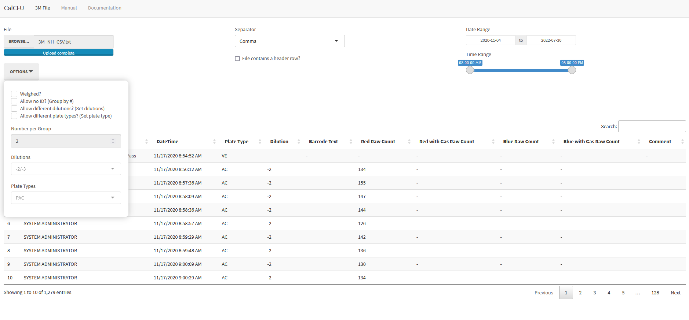

# CalCFU

[](https://hub.docker.com/r/koisland/calcfu)
[](https://pypi.org/project/calcfu/)

A CFU calculator app built in `Python` and `R` using the NCIMS 2400 standards.



---

### Table of Contents
* [CalCFU (`R Shiny` App)](#calcfu_app)
  * [Getting Started](#setup)
  * [User Guide](#calcfu_app_guide)
      * [Requirements](#calcfu_app_requirements)
      * [Data](#calcfu_app_data)
      * [Options](#calcfu_app_options)
  * [Technical Info](#calcfu_app_tech_info)
      * [Development](#calcfu_app_development)
          * [TO-DO](#calcfu_app_todo)
* [CalCFU (`Python` Module)](#calcfu_py_mod)

---

## CalCFU (`R Shiny` App) <a name="calcfu_app"></a>
This `R Shiny` app serves as a easy-to-use UI for the `calcfu` `Python` module.

### Getting Started <a name="setup"></a>
To pull the image:
```bash
docker pull koisland/calcfu
```

To build the image on your local machine:

```bash
git clone git@github.com:koisland/CalCFU.git -b app

cd CalCFU/

docker build . -t calcfu:latest

docker run -it -p 3838:3838 calcfu:latest
```

To check it out [locally.](http://localhost:3838/)

### User Guide <a name="calcfu_app_guide"></a>
This is a basic user guide to using the `CalCFU` app.

#### Requirements <a name="calcfu_app_requirements"></a>
  * *3M Petrifilm Reader*
  * *3M Petrifilm Reader Software*
      * Version:
  * *3M Petrifilm Results in CSV/TSV/SSV format (.txt)*
  * *Firefox/Edge/Chrome Browser*
    * **Avoid Internet Explorer** as `R Shiny` apps on this browser are more prone to errors.


#### Data <a name="calcfu_app_data"></a>
Proper data entry is critical for correct results.

*DO:*
  * **Label all samples!**
      * Use this format - LABEL-NUMBER:
        * LABEL should be easy to refer back to a batch sheet.
            * *S21100777 could be shortened to 777*
        * NUMBER should refer to the dilution order.
            * *777-1 -> -2, 777-2 -> -3*
      * Even if there is an initial time cost, you can refer to these results later.
  * Comment and edit results when at the 3M Reader.
      * Edited values replace the raw counts and your comments will show up in the table making it easier to check and replace strange values.
  * **Realize that any changes made in the table UI are not saved to the original file!**

*DON'T:*
  * Modify the original text file.
  * Blindly copy values.
    * If samples are improperly labeled, groups maybe merged and used in different calculations.

#### Options <a name="calcfu_app_options"></a>
  * *Weighed*
      * Adds a "g" to the units.
      * Default: "mL" to the units.
  * *Allow No ID?*
    * Allows calculation with no IDs with a set number to group by.
      * The group number must be a divisor of the total number of rows.
          * *84 rows with groups of 3 is okay*.
          * *84 rows with groups of 5 is not okay*.
      * Default: Use Sample IDs to group plates by.
          * If no ID is provided, order entered is used for dilution order.
      * Verification plates are always omitted.
  * *Allow Different Dilutions?*
    * Ignore dilutions and use a set dilution group for calculations.
    * If the number of plates is >2, cycle through the dilutions.
  * *Allow Different Plate Types?*
    * Ignore plate types and use a set plate type for calculations.
    * Each plate type uses different columns to calculate values.
      * PAC - Red Raw Count
      * RAC - Red Raw Count, Blue Raw Count
      * PCC - Red Gas Raw Count

### Technical Info <a name="calcfu_app_tech_info"></a>

#### Development <a name="calcfu_app_development"></a>
All future updates to this project can be found [here.](https://github.com/koisland/CalCFU)

While I would like this to see wider and more expanded usage (LIMS integration), much of the 3M Reader usage rules are tied to the NCIMS 2400s which is fairly strict and has seen little change over the years.

Feel free to contact me at <koshima789@gmail.com> for any questions, concerns, or new ideas.

##### TO-DO <a name="calcfu_app_todo"></a>
  * [ ] Download results.
  * [ ] `R` and `Python` unit tests for reader.
  * [ ] Better manual calculator UI and settings.

---

## CalCFU (`Python` Module) <a name="calcfu_py_mod"></a>
The Python scripts in this app calculate CFU counts for plating methods outlined in the NCIMS 2400 using two custom classes.
* `Plate` for storing plate characteristics.
* `CalCFU` for the calculator logic.

View the source code on [GitHub](https://github.com/koisland/CalCFU/tree/py_mod).

To install [calcfu](https://pypi.org/project/calcfu/) and test it:
```bash
pip install calcfu
```
